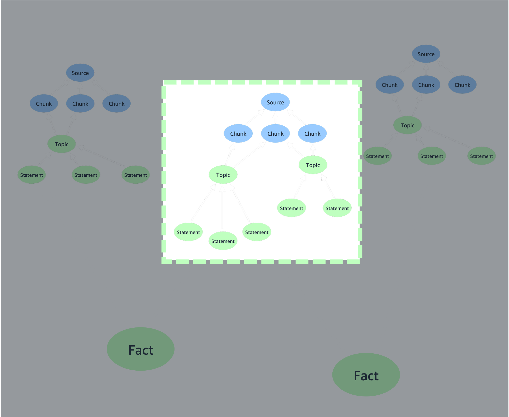
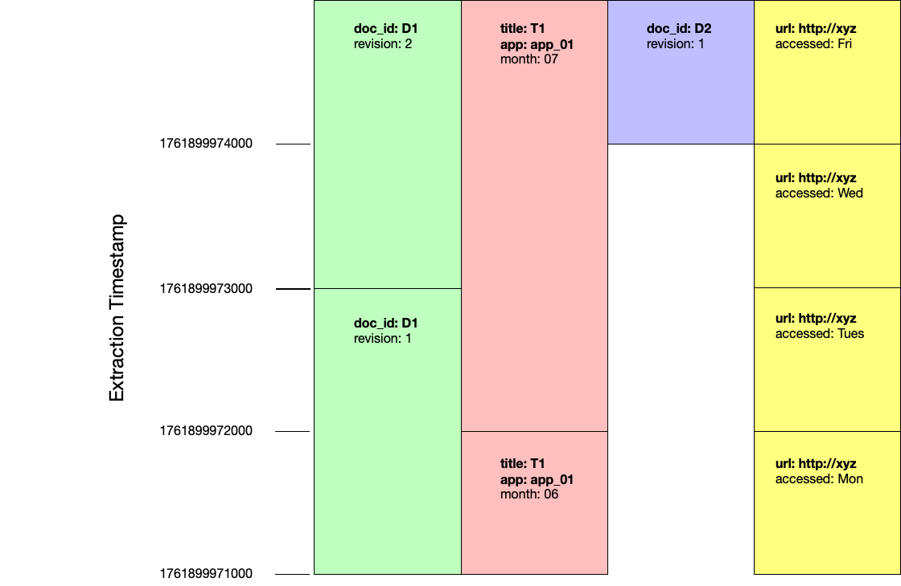
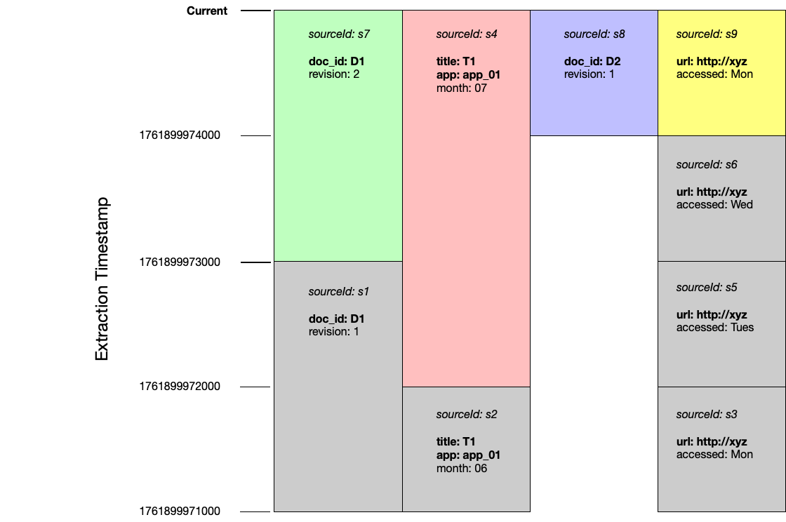
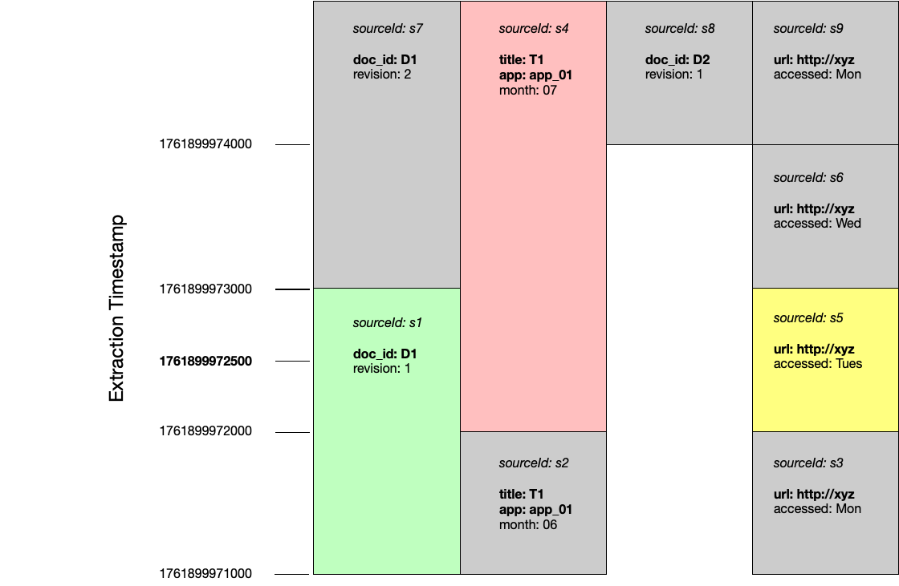

[[Home](./)]

## Versioned Updates

### Topics

  - [Overview](#overview)
  - [Document subgraphs](#document-subgraphs)
    - [Stable document identities](#stable-document-identities)
  - [Using versioned updates](#using-versioned-updates)
    - [Indexing](#indexing)
    - [Querying](#querying)
    - [Combining versioned updates with metadata filtering](#combining-versioned-updates-with-metadata-filtering)
  - [Example](#example)
  - [Inspecting source metadata](#inspecting-source-metadata)
    - [Get details of all source nodes](#get-details-of-all-source-nodes)
    - [Get details of all current source nodes](#get-details-of-all-current-source-nodes)
    - [Get details of all previous source nodes](#get-details-of-all-previous-source-nodes)
    - [Get details of previous versions of files with specific metadata](#get-details-of-previous-versions-of-files-with-specific-metadata)
  - [Upgrading existing graph and vector stores](#upgrading-existing-graph-and-vector-stores)
    - [Upgrading specific tenants](#upgrading-specific-tenants)
    - [Upgrading specific vector indexes](#upgrading-specific-vector-indexes)

### Overview

The graphrag-toolkit allows you to version source documents along a single timeline based on _extraction_ timestamps. Using this versioned update feature, if you re-ingest a document whose contents and/or metadata have changed since it was last extracted, any old documents will be archived, and the newly ingested document treated as the current version of the source document.

### Document subgraphs

The `(source)<--(chunk)<--(topic)<--(statement)` part of the lexical graph model represents a bounded document subgraph. The id of a source node is a function of the metadata and textual contents of a source document. The ids of chunks, topics, and statements are in turn a function of the source id. If the metadata and/or contents of a source document change, and the document is reprocessed, the source will be assigned a different id – and so will all the chunks, topics and statements that derive from that source.



This means that if you extract two different versions of a document (i.e. versions with different contents and/or metadata) at different times, you’ll end up with two different bounded document subgraphs: two source nodes, and then independent `(chunk)<--(topic)<--(statement)` subgraphs beneath each of those source nodes. If the toolkit's versioning feature is enabled, the last version of the document to be extracted will be treated as the current version, and all other versions marked as historical, archived versions.

#### Stable document identities

For a document to be versioned in this manner, there must be some way of specifying that different sets of text and metadata represent _different_ versions of the _same_ document. In other words, the document must have a stable identity, independent of variations in content and/or metadata. 

The graphrag-toolkit uses a concept of _version-independent metadata fields_ to represent this stable identify. When you index a document, you can specify which of that document's metadata fields represent its stable identify. For example, if a document has `title`, `author` and `last_updated` metadata fields, you might specify that a combination of the `title` and `author` metadata fields represent that document's stable identify. When the document is indexed, any previously indexed, non-versioned documents whose `title` and `author` field _values_ match those of the newly ingested document will be archived.

### Using versioned updates

If you have an existing graph and vector store built by a version of the graphrag-toolkit prior to version 3.14, you will need to upgrade them first. See [Upgrading existing graph and vector stores](#upgrading-existing-graph-and-vector-stores).

#### Indexing

Indexed documents are versioned based on _extraction_ timestamps. A document will be `valid_from` the timestamp when it was extracted. If a different version of the document is subsequently indexed, the old version will be considered `valid_to` the extraction timestamp of the new version.

When _extracting_ data (using `LexicalGraphIndex.extract()` or `LexicalGraphIndex.extract_and_build()`), you must add the names of _version-independent metadata fields_ to the metadata of each document you want to update and version. 

When _building_ a lexical graph (using `LexicalGraphIndex.build()` or `LexicalGraphIndex.extract_and_build()`), you must enable versioning, using either the `GraphRAGConfig.enable_versioning=True` global configuration parameter, or by passing a `BuildConfig(enable_versioning=True)` configuration object to the `LexicalGraphIndex` constructor, or by passing `enable_versioning=True` to the `LexicalGraphIndex.build()` or `LexicalGraphIndex.extract_and_build()` methods. 

The presence of `enable_versioning=True` forces the build process to check for previous versions of each document, as identified by the version-independent metadata fields supplied in the extract stage.

The following example uses `LexicalGraphIndex.extract_and_build()` to extract data from a local directory and build a lexical graph. The `get_file_metadata()` function wraps the metadata produced by the `default_file_metadata_func()` to indicate that the `file_name` and `file_path` metadata fields together act as a version-independent identifier:

```python
import os

from graphrag_toolkit.lexical_graph import LexicalGraphIndex, GraphRAGConfig
from graphrag_toolkit.lexical_graph import add_versioning_info
from graphrag_toolkit.lexical_graph.storage import GraphStoreFactory
from graphrag_toolkit.lexical_graph.storage import VectorStoreFactory

from llama_index.core import SimpleDirectoryReader
from llama_index.core.readers.file.base import default_file_metadata_func

GraphRAGConfig.enable_versioning = True

def get_file_metadata(file_path):
    metadata = default_file_metadata_func(file_path)
    return add_versioning_info(metadata, id_fields=['file_name', 'file_path'])

with(
    GraphStoreFactory.for_graph_store(os.environ['GRAPH_STORE']) as graph_store,
    VectorStoreFactory.for_vector_store(os.environ['VECTOR_STORE']) as vector_store
):
    graph_index = LexicalGraphIndex(
        graph_store, 
        vector_store
    )
    
    reader = SimpleDirectoryReader(input_dir='./my_docs/', file_metadata=get_file_metadata)
    
    docs = reader.load_data()
    graph_index.extract_and_build(docs)
```

The example above uses `GraphRAGConfig.enable_versioning = True` to force versioning checks during the build stage. Alternatively, you can supply a `BuildConfig` object:

```python
from graphrag_toolkit.lexical_graph import LexicalGraphIndex, BuildConfig

graph_index = LexicalGraphIndex(
  graph_store, 
  vector_store,
  indexing_config=BuildConfig(enable_versioning=True)
)
```

Or you can pass an `enable_versioning=True` keyword argument to the build method:

```python
graph_index.extract_and_build(
  docs,
  enable_versioning=True
)
```

##### Do I need to specify id fields for every document?

No. You only need to specify the names of version-independent metadata fields for documents you wish to update and version. You don't have to specify these fields the first time you index a document (though you can), only when you re-index a document.

If you anticipate using the versioned updates feature, you should take care to ensure that all documents that might be updated and versioned in the future carry metadata fields that can act as version-independent metadata fields. You cannot add to or modify the metadata attached to a source document once it has been added to the lexical graph. This means you should plan ahead when ingesting data that might be versioned in the future.

#### Querying

To take advantage of the versioned updates feature when querying a lexical graph, you must use either the `GraphRAGConfig.enable_versioning=True` global configuration parameter or the `versioning` keyword argument when creating a `LexicalGraphQueryEngine`. The `versioning` keyword argument accepts either a boolean, or a `VersioningConfig` object. The latter allows you to specify an historical timestamp, so that you can query the state of the graph at a particular point in time.

If you do not specify that versioning is to be used, the query engine will generate a response that ignores all versioning information in the lexical graph.

The following example uses `GraphRAGConfig.enable_versioning = True` to query against the current state of the lexical graph:

```python
import os

from graphrag_toolkit.lexical_graph import LexicalGraphQueryEngine, GraphRAGConfig

GraphRAGConfig.enable_versioning = True

with(
    GraphStoreFactory.for_graph_store(os.environ['GRAPH_STORE']) as graph_store,
    VectorStoreFactory.for_vector_store(os.environ['VECTOR_STORE']) as vector_store
):
    query_engine = LexicalGraphQueryEngine.for_traversal_based_search(
        graph_store, 
        vector_store
    )
    
    response = query_engine.query('Which instance families are available for Amazon Neptune?')
```

The next example uses the `versioning=True` keyword argument supplied to a `LExicalGraphQueryEngine` to query against the current state of the lexical graph:

```python
import os

from graphrag_toolkit.lexical_graph import LexicalGraphQueryEngine

with(
    GraphStoreFactory.for_graph_store(os.environ['GRAPH_STORE']) as graph_store,
    VectorStoreFactory.for_vector_store(os.environ['VECTOR_STORE']) as vector_store
):
    query_engine = LexicalGraphQueryEngine.for_traversal_based_search(
        graph_store, 
        vector_store,
        versioning=True
    )
    
    response = query_engine.query('Which instance families are available for Amazon Neptune?')
```

The following example uses a `VersioningConfig` object to query against the historical state of the lexical graph at a specific point in time:

```python
import os

from graphrag_toolkit.lexical_graph import LexicalGraphQueryEngine, VersioningConfig

GraphRAGConfig.enable_versioning = True

with(
    GraphStoreFactory.for_graph_store(os.environ['GRAPH_STORE']) as graph_store,
    VectorStoreFactory.for_vector_store(os.environ['VECTOR_STORE']) as vector_store
):
    query_engine = LexicalGraphQueryEngine.for_traversal_based_search(
        graph_store, 
        vector_store,
        versioning=VersioningConfig(at_timestamp=1761899971500)
    )
    
    response = query_engine.query('Which instance families are available for Amazon Neptune?')
```

#### Combining versioned updates with metadata filtering

You can combine versioned updates with metadata filtering. Metadata filtering allows you to filter documents based on domain-specific metadata that you control; versioning allows you to filter documents based on their history along the extraction timeline.

```python
import os

from graphrag_toolkit.lexical_graph import LexicalGraphQueryEngine
from graphrag_toolkit.lexical_graph.metadata import FilterConfig
from llama_index.core.vector_stores.types import FilterOperator, MetadataFilter

with(
    GraphStoreFactory.for_graph_store(os.environ['GRAPH_STORE']) as graph_store,
    VectorStoreFactory.for_vector_store(os.environ['VECTOR_STORE']) as vector_store
):
    query_engine = LexicalGraphQueryEngine.for_traversal_based_search(
        graph_store, 
        vector_store,
        versioning=True,
        filter_config = FilterConfig(
            MetadataFilter(
                key='url',
                value='https://docs.aws.amazon.com/neptune/latest/userguide/intro.html',
                operator=FilterOperator.EQ
            )
        )
    )
    
    response = query_engine.query('What are the differences between Neptune Database and Neptune Analytics?')
```

### Example

The following diagram shows four rounds of extraction:



Documents are inserted and versioned in the following order:

| extraction timestamp | source id | metadata | version independent fields | replaces |
| --- | --- | --- | --- | --- |
| 1761899971000 | s1 | `{'doc_id': 'D1', 'revision': 1}` | | |
| | s2 | `{'title': 'T1', 'app': 'app_01', 'month': '06'}` | | |
| | s3 | `{'url': 'http://xyz', 'accessed': 'Mon'}` | | |
| 1761899972000 | s4 | `{'title': 'T1', 'app': 'app_01', 'month': '07'}` | `['title', 'app']` | s2 |
| | s5 | `{'url': 'http://xyz', 'accessed': 'Tues'}` | `['url']` | s3 |
| 1761899973000 | s6 | `{'url': 'http://xyz', 'accessed': 'Wed'}` | `['url']` | s5 |
| | s7 | `{'doc_id': 'D1', 'revision': 2}` | `['doc_id']` | s1 |
| 1761899974000 | s8 | `{'doc_id': 'D2', 'revision': 1}` | `['doc_id']` | |
| | s9 | `{'url': 'http://xyz', 'accessed': 'Mon'}` | `['url']` | s6 |

#### Querying current documents

At the end of these four rounds of extraction, the documents s7, s4, s8 and s9 are considered current:



#### Querying at a point in time

If we were to query at timestamp 1761899972500, documents s1, s4 and s5 would be considered current:



### Inspecting source metadata

You can inspect the metadata and versioining infomration attached to source nodes using the `LexicalGraphIndex.get_sources()` method.

#### Get details of all source nodes

```python
import os
import json

from graphrag_toolkit.lexical_graph import LexicalGraphIndex
from graphrag_toolkit.lexical_graph.storage import GraphStoreFactory
from graphrag_toolkit.lexical_graph.storage import VectorStoreFactory

with (
    GraphStoreFactory.for_graph_store(os.environ['GRAPH_STORE']) as graph_store,
    VectorStoreFactory.for_vector_store(os.environ['VECTOR_STORE']) as vector_store
):

    graph_index = LexicalGraphIndex(
        graph_store, 
        vector_store,
        tenant_id='tenant123' # optional - uses default tenant if not specified
    )
    
    sources = graph_index.get_sources()
    
    print(json.dumps(sources, indent=2))
```

The results are formatted like this:

```json
[
  {
    "metadata": {
      "file_path": "/home/myuser/docs/readme.md",
      "creation_date": "2025-12-16T00:00:00.000Z",
      "file_name": "readme.md",
      "title": "How to play",
      "file_size": 93,
      "last_modified_date": "2025-12-16T00:00:00.000Z",
      "file_type": "text/markdown",
      "version": "v1"
    },
    "versioning": {
      "build_timestamp": 1765880067513,
      "id_fields": [
        "file_name",
        "title"
      ],
      "valid_from": 1761899971000,
      "valid_to": 1761899972000,
      "extract_timestamp": 1765880063557
    },
    "sourceId": "aws:tenant123:31141440:6de6"
  },
  {
    "metadata": {
      "file_path": "/home/myuser/docs/readme.md",
      "creation_date": "2025-12-16T00:00:00.000Z",
      "file_name": "readme.md",
      "title": "How to play",
      "file_size": 91,
      "last_modified_date": "2025-12-16T00:00:00.000Z",
      "file_type": "text/markdown",
      "version": "v2"
    },
    "versioning": {
      "build_timestamp": 1765880102994,
      "id_fields": [
        "file_name",
        "title"
      ],
      "valid_from": 1761899972000,
      "valid_to": 1761899973000,
      "extract_timestamp": 1765880098515
    },
    "sourceId": "aws:tenant123:34570f12:0726"
  },
  {
    "metadata": {
      "file_path": "/home/myuser/docs/readme.md",
      "creation_date": "2025-12-16T00:00:00.000Z",
      "file_name": "readme.md",
      "title": "How to play",
      "file_size": 93,
      "last_modified_date": "2025-12-16T00:00:00.000Z",
      "file_type": "text/markdown",
      "version": "v3"
    },
    "versioning": {
      "build_timestamp": 1765880173432,
      "id_fields": [
        "file_name",
        "title"
      ],
      "valid_from": 1761899973000,
      "valid_to": 1761899974000,
      "extract_timestamp": 1765880166001
    },
    "sourceId": "aws:tenant123:07ca52e6:8960"
  },
  {
    "metadata": {
      "file_path": "/home/myuser/docs/readme.md",
      "creation_date": "2025-12-16T00:00:00.000Z",
      "file_name": "readme.md",
      "title": "How to play",
      "file_size": 83,
      "last_modified_date": "2025-12-16T00:00:00.000Z",
      "file_type": "text/markdown",
      "version": "v4"
    },
    "versioning": {
      "build_timestamp": 1765880242134,
      "id_fields": [
        "file_name",
        "title"
      ],
      "valid_from": 1761899974000,
      "valid_to": 10000000000000,
      "extract_timestamp": 1765880236433
    },
    "sourceId": "aws:tenant123:7a54612d:57b8"
  }
]
```

#### Get details of all current source nodes

```python
import os
import json

from graphrag_toolkit.lexical_graph import LexicalGraphIndex
from graphrag_toolkit.lexical_graph.storage import GraphStoreFactory
from graphrag_toolkit.lexical_graph.storage import VectorStoreFactory
from graphrag_toolkit.lexical_graph.versioning import VersioningConfig, VersioningMode

with (
    GraphStoreFactory.for_graph_store(os.environ['GRAPH_STORE']) as graph_store,
    VectorStoreFactory.for_vector_store(os.environ['VECTOR_STORE']) as vector_store
):

    graph_index = LexicalGraphIndex(
        graph_store, 
        vector_store,
        tenant_id='tenant123' # optional - uses default tenant if not specified
    )
    
    versioning_config = VersioningConfig(versioning_mode=VersioningMode.CURRENT)
    
    sources = graph_index.get_sources(versioning_config=versioning_config)
    
    print(json.dumps(sources, indent=2))
```

#### Get details of all previous source nodes

```python
import os
import json

from graphrag_toolkit.lexical_graph import LexicalGraphIndex
from graphrag_toolkit.lexical_graph.storage import GraphStoreFactory
from graphrag_toolkit.lexical_graph.storage import VectorStoreFactory
from graphrag_toolkit.lexical_graph.versioning import VersioningConfig, VersioningMode

with (
    GraphStoreFactory.for_graph_store(os.environ['GRAPH_STORE']) as graph_store,
    VectorStoreFactory.for_vector_store(os.environ['VECTOR_STORE']) as vector_store
):

    graph_index = LexicalGraphIndex(
        graph_store, 
        vector_store,
        tenant_id='tenant123' # optional - uses default tenant if not specified
    )
    
    versioning_config = VersioningConfig(versioning_mode=VersioningMode.PREVIOUS)
    
    sources = graph_index.get_sources(versioning_config=versioning_config)
    
    print(json.dumps(sources, indent=2))
```

#### Get details of previous versions of files with specific metadata

```python
import os
import json

from graphrag_toolkit.lexical_graph import LexicalGraphIndex
from graphrag_toolkit.lexical_graph.storage import GraphStoreFactory
from graphrag_toolkit.lexical_graph.storage import VectorStoreFactory
from graphrag_toolkit.lexical_graph.versioning import VersioningConfig, VersioningMode

with (
    GraphStoreFactory.for_graph_store(os.environ['GRAPH_STORE']) as graph_store,
    VectorStoreFactory.for_vector_store(os.environ['VECTOR_STORE']) as vector_store
):

    graph_index = LexicalGraphIndex(
        graph_store, 
        vector_store,
        tenant_id='tenant123' # optional - uses default tenant if not specified
    )
    
    versioning_config = VersioningConfig(versioning_mode=VersioningMode.PREVIOUS)
    
    sources = graph_index.get_sources(
        filter={
            'file_name': 'readme.md',
            'title': 'How to play'
        },
        versioning_config=versioning_config
    )
    
    print(json.dumps(sources, indent=2))
```

### Upgrading existing graph and vector stores

If you have existing graph and vector stores created by a version of the graphrag-toolkit prior to version 3.14.x, you will need to upgrade them before using the versioned updates feature. The graphrag-toolkit includes an `upgrade_for_versioning.py` script that will upgrade a graph and vector store so that you can use versioned updates.

> Do not index any documenst while the upgrade script is running.

Download the [`upgrade_for_versioning.py`](https://github.com/awslabs/graphrag-toolkit/blob/main/examples/lexical-graph/scripts/upgrade_for_versioning.py) script to an environment that can access your graph and vector stores. Then run:

```
python upgrade_for_versioning.py --graph-store <graph_store_info> --vector_store <vector_store_info>
```

#### Upgrading specific tenants

By default, the script upgrades all [tenants](./multi-tenancy.md) in the graph and vector stores. You can restrict the list of tenants using the `--tenant-ids <space_separated_tenant_ids>` parameter. For example:

```
python upgrade_for_versioning.py --graph-store <graph_store_info> --vector_store <vector_store_info> --tenant-ids t1 t2 _default
```

Note that `_default` identifies the default tenant.

#### Upgrading specific vector indexes

By default, the script only updates the chunk index for each tenant. Your vector store may also contain a statement index, which is used by the [semantic-guide search](./semantic-guided-search.md). Semantic-guided search is likely to be removed in future versions of the toolkit – to avoid unnecessary work, we therefore recommend _not_ upgrading this index.

If, however, you do want to upgrade the statement index, supply an `--index-names <space_separated_index_names>` parameter:

```
python upgrade_for_versioning.py --graph-store <graph_store_info> --vector_store <vector_store_info> --index_names chunk statement
```
